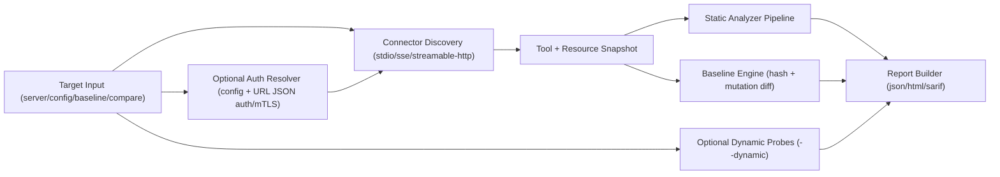

# MCP Security Scanner

[](https://github.com/ogulcanaydogan/mcp-security-scanner/actions/workflows/ci.yml)
[](LICENSE)
[](.)
[](https://pypi.org/project/ogulcanaydogan-mcp-security-scanner/)

Security scanner for Model Context Protocol (MCP) servers.
It analyzes server capabilities, detects policy and runtime risks, and exports findings as `json`, `html`, or `sarif`.

## Why This Project

- Secure MCP integrations before production rollout.
- Detect static misconfiguration and capability risk early.
- Compare baseline snapshots to catch risky tool mutations.
- Optionally run bounded dynamic probes with `--dynamic`.

## Architecture



## Capability Snapshot (Sprint 1-9V)

| Area | Status |
|---|---|
| Transports | `stdio`, `sse`, `streamable-http` |
| Commands | `server`, `config`, `baseline`, `compare`, `cache rotate` |
| Default analyzers | `Static`, `PromptInjection`, `Escalation`, `ToolPoisoning`, `CrossTool` |
| Dynamic mode | Opt-in (`--dynamic`), bounded and deterministic |
| OAuth auth types | `oauth_client_credentials`, `oauth_device_code`, `oauth_auth_code_pkce` |
| Token endpoint auth methods | `client_secret_post`, `client_secret_basic`, `private_key_jwt` |
| Persistent cache backends | `local`, `aws_secrets_manager`, `aws_ssm_parameter_store`, `gcp_secret_manager`, `azure_key_vault`, `hashicorp_vault`, `kubernetes_secrets`, `oci_vault`, `doppler_secrets`, `onepassword_connect`, `bitwarden_secrets`, `infisical_secrets`, `akeyless_secrets`, `gitlab_variables`, `gitlab_group_variables`, `gitlab_instance_variables`, `github_actions_variables`, `github_environment_variables`, `github_organization_variables`, `consul_kv`, `redis_kv`, `cloudflare_kv`, `etcd_kv`, `postgres_kv`, `mysql_kv`, `mongo_kv`, `dynamodb_kv`, `s3_object_kv`, `sqlite_kv` |
| Release pipeline | OIDC publish + Sigstore + idempotent GitHub release + build-wheel CLI smoke + tag/version consistency guard (`pyproject`/`__version__`/wheel/CLI) + PyPI visibility verification |
| mTLS | OAuth token-endpoint mTLS + transport discovery mTLS |
| Compare contract | only `tool_added`, `tool_removed`, `tool_changed` mapped to `LLM05` |

## Current Scope Details

- `config` supports auth/session flow v1 for network transports (`bearer`, `api_key`, `session_cookie`, `oauth_client_credentials`, `oauth_device_code`, `oauth_auth_code_pkce`)
- Optional persistent OAuth cache hardening (strict lock, corruption recovery, metadata key management, multi-key recovery)
- OAuth provider hardening+ (tolerant token parsing and transient retry policy for token endpoints)
- OAuth provider integrations v2 in `config` auth: `token_endpoint_auth_method=private_key_jwt` supports env/file/AWS KMS signing sources
- Release stabilization (Sprint 8D): PyPI distribution name switched to `ogulcanaydogan-mcp-security-scanner` to avoid name collision
- Release hardening (Sprint 8J): publish workflow uses idempotent `gh release` create/upload path and tag-scoped publish concurrency guard
- OAuth cache provider expansion (Sprint 8K): added `aws_ssm_parameter_store` backend (pre-provisioned SecureString parameter model)
- OAuth cache provider expansion (Sprint 8L): added `kubernetes_secrets` backend (in-cluster auth + kubeconfig fallback, pre-provisioned Secret model)
- OAuth cache provider expansion (Sprint 8M): added `oci_vault` backend (resource principal first, OCI config fallback, pre-provisioned secret model)
- Release + contract hardening (Sprint 8N): pre-publish tag/version guard, post-publish PyPI visibility retry check, and shared OAuth cache backend invariant tests
- OAuth cache provider expansion (Sprint 8O): added `doppler_secrets` backend (env-token auth, pre-provisioned secret model)
- OAuth cache provider expansion (Sprint 8P): added `onepassword_connect` backend (env-token auth, pre-provisioned item/field model)
- OAuth cache provider expansion (Sprint 8Q): added `bitwarden_secrets` backend (env-token auth, pre-provisioned secret model)
- OAuth cache provider expansion (Sprint 8R): added `infisical_secrets` backend (env-token auth, pre-provisioned secret model)
- OAuth cache provider expansion (Sprint 8S): added `akeyless_secrets` backend (env-token auth, pre-provisioned secret model)
- OAuth cache provider expansion (Sprint 8T): added `gitlab_variables` backend (env-token auth, pre-provisioned project variable model)
- OAuth cache provider expansion (Sprint 8U): added `github_actions_variables` backend (env-token auth, pre-provisioned repository variable model)
- OAuth cache provider expansion (Sprint 8V): added `github_environment_variables` backend (env-token auth, pre-provisioned repository environment variable model)
- OAuth cache provider expansion (Sprint 8W): added `github_organization_variables` backend (env-token auth, pre-provisioned organization variable model)
- Release + contract hardening (Sprint 8X): added build-wheel CLI smoke verification, publish-time wheel/tag version guard, and expanded `persistent=false` backend invariant coverage
- OAuth cache provider expansion (Sprint 8Y): added `consul_kv` backend (env-token auth, pre-provisioned KV key model)
- OAuth cache provider expansion (Sprint 8Z): added `redis_kv` backend (env-password auth, pre-provisioned key model)
- Stabilization hardening (Sprint 8AA): centralized OAuth cache backend dispatch contract + stricter publish-time version consistency checks (`pyproject`, `__version__`, wheel metadata, CLI)
- OAuth cache provider expansion (Sprint 8AB): added `cloudflare_kv` backend (env-token auth, pre-provisioned KV key model)
- OAuth cache provider expansion (Sprint 8AC): added `gitlab_group_variables` backend (env-token auth, pre-provisioned group variable model)
- v1.0 RC stabilization (Sprint 8AD): feature-freeze with backend contract lock, RC-safe tag/version normalization (`v1.0.0-rcN` -> `1.0.0rcN`) in publish guards, and post-1.0 deferred-provider positioning
- v1.0.0 GA finalization: RC2 snapshot promoted to stable without runtime/CLI/auth/report contract changes
- Post-1.0 provider v2 expansion (Sprint 9A): GitLab project/group variable backends now support optional `gitlab_environment_scope` (default `*`)
- Post-1.0 provider v2 expansion (Sprint 9B): GitHub organization variable backend preserves existing visibility (`all` / `private` / `selected`) during cache updates
- Post-1.0 stabilization hardening (Sprint 9C): OAuth cache dispatch error paths fail closed (`load -> {}`, `persist -> no-op`) and publish visibility verification uses explicit PyPI index/no-cache flags
- Post-1.0 provider expansion (Sprint 9D): added `etcd_kv` backend (etcd v3 JSON API, env-token auth, pre-provisioned key model)
- Post-1.0 stabilization hardening (Sprint 9E): centralized remote backend spec as canonical source for dispatch maps and tightened matrix contract coverage without runtime behavior changes
- Post-1.0 provider expansion (Sprint 9F): added `gitlab_instance_variables` backend (GitLab admin instance variable API, env-token auth, pre-provisioned variable model without environment scope)
- Post-1.0 stabilization hardening (Sprint 9G): centralized GitLab backend capability matrix reused across validation and API path/query/body builders, plus single-script version consistency checks reused in build/publish CI stages
- Post-1.0 provider expansion (Sprint 9H): added `postgres_kv` backend (psycopg3 env-DSN auth, fixed-schema pre-provisioned row model)
- Post-1.0 stabilization hardening (Sprint 9I): expanded backend-dispatch contract resolver coverage and consolidated PyPI visibility verification under the shared release-consistency script (runtime behavior unchanged)
- Post-1.0 provider expansion (Sprint 9J): added `mysql_kv` backend (PyMySQL env-DSN auth, fixed-schema pre-provisioned row model)
- Post-1.0 stabilization hardening (Sprint 9K): centralized OAuth cache backend-contract checks and tightened deterministic release consistency validation without runtime behavior changes
- Post-1.0 stabilization hardening (Sprint 9L): strengthened backend-contract mismatch detection (including supported-set drift), improved deterministic PyPI visibility retry logging for transient failures, and kept runtime behavior unchanged
- Post-1.0 provider expansion (Sprint 9M): added `mongo_kv` backend (PyMongo env-DSN auth, fixed-schema pre-provisioned document model)
- Post-1.0 stabilization hardening (Sprint 9N): centralized OAuth cache contract snapshot checks (including callable-map drift guards) and tightened deterministic PyPI visibility diagnostics with explicit index/timeout inputs in the shared release-consistency script
- Post-1.0 provider expansion (Sprint 9O): added `dynamodb_kv` backend (boto3 DynamoDB client with existing AWS region/endpoint settings, fixed-schema pre-provisioned item model)
- Post-1.0 stabilization hardening (Sprint 9P): canonical OAuth cache contract mismatch diagnostics now emit deterministic missing/extra backend details, and PyPI visibility retries log deterministic attempt-scoped diagnostics in the shared release-consistency script
- Post-1.0 provider expansion (Sprint 9Q): added `s3_object_kv` backend (boto3 S3 object client with existing AWS region/endpoint settings, fixed-schema pre-provisioned object model)
- Post-1.0 stabilization hardening (Sprint 9R): canonical backend contract expected-map baseline is now initialized from spec-derived sources and PyPI visibility diagnostics are emitted through a deterministic attempt-scoped logger (no runtime behavior change)
- Post-1.0 GitLab v2 finalization (Sprint 9S): GitLab capability contract is explicitly locked so `gitlab_environment_scope` remains supported only for project/group backends while instance backend stays scope-forbidden (`auth_config_error`) due upstream API limits
- Post-1.0 stabilization hardening (Sprint 9T): release-consistency PyPI retry diagnostics now normalize volatile memory-address fragments for deterministic logs while preserving retry semantics and runtime behavior
- Post-1.0 stabilization hardening (Sprint 9U): OAuth cache contract snapshot checks now use detached map snapshots for stricter drift isolation, and release-visibility diagnostics are covered by deterministic retry-path tests (runtime behavior unchanged)
- Post-1.0 provider expansion (Sprint 9V): added `sqlite_kv` backend (`sqlite3` env-DSN auth, fixed-schema pre-provisioned row model)
- Post-1.0 stabilization hardening (Sprint 9W): centralized OAuth cache contract mismatch validation through shared deterministic helpers (`set/source/callable` deltas) and added explicit final-attempt PyPI visibility failure events in release-consistency diagnostics (runtime behavior unchanged)
- Post-1.0 stabilization hardening (Sprint 9X): unified contract mismatch evaluation into one deterministic candidate pipeline and extracted deterministic PyPI visibility command/env builders (runtime behavior unchanged)
- Baseline mutation detection (`added` / `removed` / `changed`) with deterministic hashes
- Severity threshold filtering and documented exit-code contract

## Installation

From PyPI (after trusted publisher mapping is enabled and first publish succeeds):

```bash
pip install ogulcanaydogan-mcp-security-scanner
```

From source:

```bash
git clone https://github.com/ogulcanaydogan/mcp-security-scanner.git
cd mcp-security-scanner
pip install -e .[dev]
```

## PyPI Operations Checklist (Single Owner)

Current owner model is single-account (`ogulcan`). Keep these controls in place:

- Ensure PyPI 2FA is enabled and recovery codes are stored offline.
- Keep account email access current and verified before release windows.
- In project publishing settings, keep exactly one active trusted publisher for:
  - repository `ogulcanaydogan/mcp-security-scanner`
  - workflow `ci.yml`
  - environment `(Any)` (empty)
- Remove stale duplicate/pending publisher records for the same project.

## Quick Start

```bash
# Version check
mcp-scan --version

# Scan a stdio server command
mcp-scan server "python -m my_mcp_server" --format json

# Scan a URL target (auto-detected: streamable-http, fallback to sse)
mcp-scan server "https://example.com/sse" --format html --output report.html

# Scan a URL target with auth/header/mTLS JSON options
mcp-scan server "https://example.com/mcp" \
  --headers-json '{"X-Trace":"run-42"}' \
  --auth-json '{"type":"api_key","key_env":"MCP_API_KEY"}' \
  --mtls-cert-file /etc/mcp/client.crt \
  --mtls-key-file /etc/mcp/client.key \
  --format json

# Run dynamic probes in addition to default analyzers (opt-in)
mcp-scan server "python -m my_mcp_server" --dynamic --format json

# Build baseline from live server snapshot
mcp-scan baseline "python -m my_mcp_server" --save baseline.json

# Compare live snapshot with baseline
mcp-scan compare baseline.json "python -m my_mcp_server" --format sarif --output mutations.sarif

# Rotate persistent OAuth cache encryption key
mcp-scan cache rotate
```

## `config` Command (Claude Desktop Config)

`mcp-scan config` reads `mcpServers` entries and scans each server sequentially.

```bash
mcp-scan config ~/.claude/claude_desktop_config.json --timeout 30 --format json
```

Supported entry styles:

```json
{
  "mcpServers": {
    "local-stdio": {
      "transport": "stdio",
      "command": "python",
      "args": ["-m", "my_mcp_server"],
      "env": {"APP_ENV": "prod"}
    },
    "remote-sse": {
      "transport": "sse",
      "url": "https://example.com/sse",
      "headers": {"X-Trace": "req-42"},
      "mtls_cert_file": "/etc/mcp/transport-client.crt",
      "mtls_key_file": "/etc/mcp/transport-client.key",
      "mtls_ca_bundle_file": "/etc/mcp/transport-ca.pem",
      "auth": {"type": "bearer", "token_env": "MCP_BEARER_TOKEN"}
    },
    "remote-streamable": {
      "transport": "streamable-http",
      "url": "https://example.com/mcp",
      "auth": {"type": "api_key", "key_env": "MCP_API_KEY", "header": "X-API-Key"}
    },
    "remote-session": {
      "transport": "sse",
      "url": "https://example.com/session",
      "headers": {"Cookie": "existing=1"},
      "auth": {"type": "session_cookie", "cookie_env": "MCP_SESSION_ID", "cookie_name": "session"}
    },
    "remote-oauth": {
      "transport": "streamable-http",
      "url": "https://example.com/mcp",
      "auth": {
        "type": "oauth_client_credentials",
        "token_url": "https://auth.example.com/oauth/token",
        "client_id_env": "MCP_OAUTH_CLIENT_ID",
        "token_endpoint_auth_method": "private_key_jwt",
        "client_assertion_kms_key_id": "arn:aws:kms:eu-west-1:111122223333:key/abcd",
        "client_assertion_kms_region": "eu-west-1",
        "client_assertion_kms_endpoint_url": "https://kms.eu-west-1.amazonaws.com",
        "client_assertion_kid": "key-2026-03",
        "mtls_cert_file": "/etc/mcp/oauth-client.crt",
        "mtls_key_file": "/etc/mcp/oauth-client.key",
        "mtls_ca_bundle_file": "/etc/mcp/oauth-ca.pem",
        "scope": "mcp.read",
        "audience": "mcp-security-scanner",
        "cache": {"persistent": true, "namespace": "prod-security", "backend": "local"},
        "header": "Authorization",
        "scheme": "Bearer"
      }
    },
    "remote-oauth-aws-cache": {
      "transport": "sse",
      "url": "https://example.com/sse",
      "auth": {
        "type": "oauth_client_credentials",
        "token_url": "https://auth.example.com/oauth/token",
        "client_id_env": "MCP_OAUTH_CLIENT_ID",
        "client_secret_env": "MCP_OAUTH_CLIENT_SECRET",
        "cache": {
          "persistent": true,
          "namespace": "prod-security",
          "backend": "aws_secrets_manager",
          "aws_secret_id": "mcp-security-scanner/oauth-cache-prod",
          "aws_region": "eu-west-1",
          "aws_endpoint_url": "https://secretsmanager.eu-west-1.amazonaws.com"
        }
      }
    },
    "remote-oauth-gcp-cache": {
      "transport": "streamable-http",
      "url": "https://example.com/mcp",
      "auth": {
        "type": "oauth_client_credentials",
        "token_url": "https://auth.example.com/oauth/token",
        "client_id_env": "MCP_OAUTH_CLIENT_ID",
        "client_secret_env": "MCP_OAUTH_CLIENT_SECRET",
        "cache": {
          "persistent": true,
          "namespace": "prod-security",
          "backend": "gcp_secret_manager",
          "gcp_secret_name": "projects/my-project/secrets/mcp-security-scanner-oauth-cache",
          "gcp_endpoint_url": "https://secretmanager.googleapis.com"
        }
      }
    },
    "remote-oauth-azure-cache": {
      "transport": "sse",
      "url": "https://example.com/sse",
      "auth": {
        "type": "oauth_client_credentials",
        "token_url": "https://auth.example.com/oauth/token",
        "client_id_env": "MCP_OAUTH_CLIENT_ID",
        "client_secret_env": "MCP_OAUTH_CLIENT_SECRET",
        "cache": {
          "persistent": true,
          "namespace": "prod-security",
          "backend": "azure_key_vault",
          "azure_vault_url": "https://mcp-security.vault.azure.net",
          "azure_secret_name": "mcp-security-scanner-oauth-cache",
          "azure_secret_version": "latest"
        }
      }
    },
    "remote-oauth-vault-cache": {
      "transport": "streamable-http",
      "url": "https://example.com/mcp",
      "auth": {
        "type": "oauth_client_credentials",
        "token_url": "https://auth.example.com/oauth/token",
        "client_id_env": "MCP_OAUTH_CLIENT_ID",
        "client_secret_env": "MCP_OAUTH_CLIENT_SECRET",
        "cache": {
          "persistent": true,
          "namespace": "prod-security",
          "backend": "hashicorp_vault",
          "vault_url": "https://vault.example.com",
          "vault_secret_path": "kv/mcp-security-scanner/oauth-cache",
          "vault_token_env": "VAULT_TOKEN",
          "vault_namespace": "platform-security"
        }
      }
    },
    "remote-oauth-k8s-cache": {
      "transport": "sse",
      "url": "https://example.com/sse",
      "auth": {
        "type": "oauth_client_credentials",
        "token_url": "https://auth.example.com/oauth/token",
        "client_id_env": "MCP_OAUTH_CLIENT_ID",
        "client_secret_env": "MCP_OAUTH_CLIENT_SECRET",
        "cache": {
          "persistent": true,
          "namespace": "prod-security",
          "backend": "kubernetes_secrets",
          "k8s_secret_namespace": "mcp-security",
          "k8s_secret_name": "oauth-cache",
          "k8s_secret_key": "oauth_cache"
        }
      }
    },
    "remote-oauth-oci-cache": {
      "transport": "streamable-http",
      "url": "https://example.com/mcp",
      "auth": {
        "type": "oauth_client_credentials",
        "token_url": "https://auth.example.com/oauth/token",
        "client_id_env": "MCP_OAUTH_CLIENT_ID",
        "client_secret_env": "MCP_OAUTH_CLIENT_SECRET",
        "cache": {
          "persistent": true,
          "namespace": "prod-security",
          "backend": "oci_vault",
          "oci_secret_ocid": "ocid1.secret.oc1.iad.exampleuniqueid1234567890",
          "oci_region": "eu-frankfurt-1",
          "oci_endpoint_url": "https://vaults.eu-frankfurt-1.oci.oraclecloud.com"
        }
      }
    },
    "remote-oauth-doppler-cache": {
      "transport": "sse",
      "url": "https://example.com/sse",
      "auth": {
        "type": "oauth_client_credentials",
        "token_url": "https://auth.example.com/oauth/token",
        "client_id_env": "MCP_OAUTH_CLIENT_ID",
        "client_secret_env": "MCP_OAUTH_CLIENT_SECRET",
        "cache": {
          "persistent": true,
          "namespace": "prod-security",
          "backend": "doppler_secrets",
          "doppler_project": "security-platform",
          "doppler_config": "prd",
          "doppler_secret_name": "MCP_OAUTH_CACHE",
          "doppler_token_env": "DOPPLER_TOKEN",
          "doppler_api_url": "https://api.doppler.com"
        }
      }
    },
    "remote-oauth-onepassword-cache": {
      "transport": "streamable-http",
      "url": "https://example.com/mcp",
      "auth": {
        "type": "oauth_client_credentials",
        "token_url": "https://auth.example.com/oauth/token",
        "client_id_env": "MCP_OAUTH_CLIENT_ID",
        "client_secret_env": "MCP_OAUTH_CLIENT_SECRET",
        "cache": {
          "persistent": true,
          "namespace": "prod-security",
          "backend": "onepassword_connect",
          "op_connect_host": "https://op-connect.example.com",
          "op_vault_id": "vault-uuid-or-id",
          "op_item_id": "item-uuid",
          "op_field_label": "oauth_cache",
          "op_connect_token_env": "OP_CONNECT_TOKEN"
        }
      }
    },
    "remote-oauth-bitwarden-cache": {
      "transport": "sse",
      "url": "https://example.com/sse",
      "auth": {
        "type": "oauth_client_credentials",
        "token_url": "https://auth.example.com/oauth/token",
        "client_id_env": "MCP_OAUTH_CLIENT_ID",
        "client_secret_env": "MCP_OAUTH_CLIENT_SECRET",
        "cache": {
          "persistent": true,
          "namespace": "prod-security",
          "backend": "bitwarden_secrets",
          "bw_secret_id": "11111111-2222-3333-4444-555555555555",
          "bw_access_token_env": "BWS_ACCESS_TOKEN",
          "bw_api_url": "https://api.bitwarden.com"
        }
      }
    },
    "remote-oauth-infisical-cache": {
      "transport": "streamable-http",
      "url": "https://example.com/mcp",
      "auth": {
        "type": "oauth_client_credentials",
        "token_url": "https://auth.example.com/oauth/token",
        "client_id_env": "MCP_OAUTH_CLIENT_ID",
        "client_secret_env": "MCP_OAUTH_CLIENT_SECRET",
        "cache": {
          "persistent": true,
          "namespace": "prod-security",
          "backend": "infisical_secrets",
          "infisical_project_id": "workspace-123",
          "infisical_environment": "prod",
          "infisical_secret_name": "MCP_OAUTH_CACHE",
          "infisical_token_env": "INFISICAL_TOKEN",
          "infisical_api_url": "https://app.infisical.com/api"
        }
      }
    },
    "remote-oauth-akeyless-cache": {
      "transport": "streamable-http",
      "url": "https://example.com/mcp",
      "auth": {
        "type": "oauth_client_credentials",
        "token_url": "https://auth.example.com/oauth/token",
        "client_id_env": "MCP_OAUTH_CLIENT_ID",
        "client_secret_env": "MCP_OAUTH_CLIENT_SECRET",
        "cache": {
          "persistent": true,
          "namespace": "prod-security",
          "backend": "akeyless_secrets",
          "akeyless_secret_name": "/prod/mcp/oauth_cache",
          "akeyless_token_env": "AKEYLESS_TOKEN",
          "akeyless_api_url": "https://api.akeyless.io"
        }
      }
    },
    "remote-oauth-gitlab-cache": {
      "transport": "sse",
      "url": "https://example.com/sse",
      "auth": {
        "type": "oauth_client_credentials",
        "token_url": "https://auth.example.com/oauth/token",
        "client_id_env": "MCP_OAUTH_CLIENT_ID",
        "client_secret_env": "MCP_OAUTH_CLIENT_SECRET",
        "cache": {
          "persistent": true,
          "namespace": "prod-security",
          "backend": "gitlab_variables",
          "gitlab_project_id": "12345",
          "gitlab_variable_key": "MCP_OAUTH_CACHE",
          "gitlab_token_env": "GITLAB_TOKEN",
          "gitlab_api_url": "https://gitlab.example.com/api/v4"
        }
      }
    },
    "remote-oauth-gitlab-group-cache": {
      "transport": "sse",
      "url": "https://example.com/sse",
      "auth": {
        "type": "oauth_client_credentials",
        "token_url": "https://auth.example.com/oauth/token",
        "client_id_env": "MCP_OAUTH_CLIENT_ID",
        "client_secret_env": "MCP_OAUTH_CLIENT_SECRET",
        "cache": {
          "persistent": true,
          "namespace": "prod-security",
          "backend": "gitlab_group_variables",
          "gitlab_group_id": "67890",
          "gitlab_variable_key": "MCP_OAUTH_CACHE",
          "gitlab_token_env": "GITLAB_TOKEN",
          "gitlab_api_url": "https://gitlab.example.com/api/v4"
        }
      }
    },
    "remote-oauth-github-cache": {
      "transport": "streamable-http",
      "url": "https://example.com/mcp",
      "auth": {
        "type": "oauth_client_credentials",
        "token_url": "https://auth.example.com/oauth/token",
        "client_id_env": "MCP_OAUTH_CLIENT_ID",
        "client_secret_env": "MCP_OAUTH_CLIENT_SECRET",
        "cache": {
          "persistent": true,
          "namespace": "prod-security",
          "backend": "github_actions_variables",
          "github_repository": "ogulcanaydogan/mcp-security-scanner",
          "github_variable_name": "MCP_OAUTH_CACHE",
          "github_token_env": "GITHUB_TOKEN",
          "github_api_url": "https://api.github.com"
        }
      }
    },
    "remote-oauth-github-environment-cache": {
      "transport": "streamable-http",
      "url": "https://example.com/mcp",
      "auth": {
        "type": "oauth_client_credentials",
        "token_url": "https://auth.example.com/oauth/token",
        "client_id_env": "MCP_OAUTH_CLIENT_ID",
        "client_secret_env": "MCP_OAUTH_CLIENT_SECRET",
        "cache": {
          "persistent": true,
          "namespace": "prod-security",
          "backend": "github_environment_variables",
          "github_repository": "ogulcanaydogan/mcp-security-scanner",
          "github_environment_name": "production",
          "github_variable_name": "MCP_OAUTH_CACHE",
          "github_token_env": "GITHUB_TOKEN",
          "github_api_url": "https://api.github.com"
        }
      }
    },
    "remote-oauth-github-organization-cache": {
      "transport": "streamable-http",
      "url": "https://example.com/mcp",
      "auth": {
        "type": "oauth_client_credentials",
        "token_url": "https://auth.example.com/oauth/token",
        "client_id_env": "MCP_OAUTH_CLIENT_ID",
        "client_secret_env": "MCP_OAUTH_CLIENT_SECRET",
        "cache": {
          "persistent": true,
          "namespace": "prod-security",
          "backend": "github_organization_variables",
          "github_organization": "ogulcanaydogan",
          "github_variable_name": "MCP_OAUTH_CACHE",
          "github_token_env": "GITHUB_TOKEN",
          "github_api_url": "https://api.github.com"
        }
      }
    },
    "remote-oauth-consul-cache": {
      "transport": "streamable-http",
      "url": "https://example.com/mcp",
      "auth": {
        "type": "oauth_client_credentials",
        "token_url": "https://auth.example.com/oauth/token",
        "client_id_env": "MCP_OAUTH_CLIENT_ID",
        "client_secret_env": "MCP_OAUTH_CLIENT_SECRET",
        "cache": {
          "persistent": true,
          "namespace": "prod-security",
          "backend": "consul_kv",
          "consul_key_path": "mcp/security/oauth/cache",
          "consul_token_env": "CONSUL_HTTP_TOKEN",
          "consul_api_url": "https://consul.example.com"
        }
      }
    },
    "remote-oauth-redis-cache": {
      "transport": "streamable-http",
      "url": "https://example.com/mcp",
      "auth": {
        "type": "oauth_client_credentials",
        "token_url": "https://auth.example.com/oauth/token",
        "client_id_env": "MCP_OAUTH_CLIENT_ID",
        "client_secret_env": "MCP_OAUTH_CLIENT_SECRET",
        "cache": {
          "persistent": true,
          "namespace": "prod-security",
          "backend": "redis_kv",
          "redis_key": "mcp/security/oauth/cache",
          "redis_url": "rediss://redis.example.com:6380/0",
          "redis_password_env": "REDIS_PASSWORD"
        }
      }
    },
    "remote-oauth-cloudflare-cache": {
      "transport": "streamable-http",
      "url": "https://example.com/mcp",
      "auth": {
        "type": "oauth_client_credentials",
        "token_url": "https://auth.example.com/oauth/token",
        "client_id_env": "MCP_OAUTH_CLIENT_ID",
        "client_secret_env": "MCP_OAUTH_CLIENT_SECRET",
        "cache": {
          "persistent": true,
          "namespace": "prod-security",
          "backend": "cloudflare_kv",
          "cf_account_id": "1234567890abcdef1234567890abcdef",
          "cf_namespace_id": "fedcba0987654321fedcba0987654321",
          "cf_kv_key": "mcp/security/oauth/cache",
          "cf_api_token_env": "CLOUDFLARE_API_TOKEN",
          "cf_api_url": "https://api.cloudflare.com/client/v4"
        }
      }
    },
    "remote-oauth-etcd-cache": {
      "transport": "streamable-http",
      "url": "https://example.com/mcp",
      "auth": {
        "type": "oauth_client_credentials",
        "token_url": "https://auth.example.com/oauth/token",
        "client_id_env": "MCP_OAUTH_CLIENT_ID",
        "client_secret_env": "MCP_OAUTH_CLIENT_SECRET",
        "cache": {
          "persistent": true,
          "namespace": "prod-security",
          "backend": "etcd_kv",
          "etcd_key": "mcp/security/oauth/cache",
          "etcd_api_url": "https://etcd.example.com:2379",
          "etcd_token_env": "ETCD_TOKEN"
        }
      }
    },
    "remote-device-oauth": {
      "transport": "sse",
      "url": "https://example.com/sse",
      "auth": {
        "type": "oauth_device_code",
        "device_authorization_url": "https://auth.example.com/oauth/device/code",
        "token_url": "https://auth.example.com/oauth/token",
        "client_id_env": "MCP_OAUTH_DEVICE_CLIENT_ID",
        "client_secret_env": "MCP_OAUTH_DEVICE_CLIENT_SECRET",
        "token_endpoint_auth_method": "client_secret_post",
        "scope": "mcp.read",
        "audience": "mcp-security-scanner",
        "header": "Authorization",
        "scheme": "Bearer"
      }
    },
    "remote-auth-code": {
      "transport": "streamable-http",
      "url": "https://example.com/mcp",
      "auth": {
        "type": "oauth_auth_code_pkce",
        "authorization_url": "https://auth.example.com/oauth/authorize",
        "token_url": "https://auth.example.com/oauth/token",
        "client_id_env": "MCP_OAUTH_AUTH_CODE_CLIENT_ID",
        "scope": "mcp.read",
        "audience": "mcp-security-scanner",
        "redirect_host": "127.0.0.1",
        "redirect_port": 8765,
        "callback_path": "/callback"
      }
    }
  }
}
```

Notes:
- `stdio` validation: `command` required, `args` optional list, `env` optional object
- `sse` validation: `url` required (`http/https`), `headers` optional object
- `streamable-http` validation: `url` required (`http/https`), `headers` optional object
- `transport: "streamable_http"` alias is accepted and normalized to `streamable-http`
- `auth` is optional and only valid for `sse`/`streamable-http` entries
- `auth` validation/env resolution errors produce `auth_config_error` findings and scan continues with remaining servers
- OAuth token endpoint/network/response failures produce `auth_token_error` findings and scan continues with remaining servers
- `oauth_client_credentials` and `oauth_device_code` support optional `token_endpoint_auth_method`:
  - `client_secret_post` (default)
  - `client_secret_basic` (`oauth_device_code` requires `client_secret_env` when used)
  - `private_key_jwt` (`oauth_client_credentials` + `oauth_device_code`; `oauth_auth_code_pkce` remains unchanged)
- `private_key_jwt` validation rules:
  - exactly one signing source is required:
    - `client_assertion_key_env`
    - `client_assertion_key_file`
    - `client_assertion_kms_key_id` (AWS KMS signing)
  - optional KMS tuning: `client_assertion_kms_region`, `client_assertion_kms_endpoint_url`
  - optional `client_assertion_kid` is propagated into JWT header
  - v1 signing algorithm is `RS256`
- token endpoint mTLS options for OAuth auth entries:
  - `mtls_cert_file` + `mtls_key_file` must be provided together
  - optional `mtls_ca_bundle_file` is used as request verify bundle
  - mTLS is applied only to OAuth token endpoint calls
- transport-level mTLS options for network entries (`sse`, `streamable-http`):
  - top-level `mtls_cert_file` + `mtls_key_file` must be provided together
  - optional top-level `mtls_ca_bundle_file` is used as connection verify bundle
  - applies to discovery transport HTTP client setup (independent from `auth.mtls_*`)
- OAuth token cache key is deterministic: `namespace + token_url + client_id + scope + audience`
- `auth.cache` is optional and only valid for OAuth auth types:
  - `persistent` (bool, default `false`)
  - `namespace` (string, default `"default"`)
  - `backend` (string, default `"local"`): `local`, `aws_secrets_manager`, `aws_ssm_parameter_store`, `gcp_secret_manager`, `azure_key_vault`, `hashicorp_vault`, `kubernetes_secrets`, `oci_vault`, `doppler_secrets`, `onepassword_connect`, `bitwarden_secrets`, `infisical_secrets`, `akeyless_secrets`, `gitlab_variables`, `gitlab_group_variables`, `gitlab_instance_variables`, `github_actions_variables`, `github_environment_variables`, `github_organization_variables`, `consul_kv`, `redis_kv`, `cloudflare_kv`, `etcd_kv`, `postgres_kv`, `mysql_kv`, `mongo_kv`, `dynamodb_kv`, `s3_object_kv`, or `sqlite_kv`
  - `aws_secret_id` (required when `backend=aws_secrets_manager`)
  - `aws_ssm_parameter_name` (required when `backend=aws_ssm_parameter_store`)
  - optional `aws_region`, `aws_endpoint_url` for AWS client routing (`aws_secrets_manager` / `aws_ssm_parameter_store` / `dynamodb_kv` / `s3_object_kv`)
  - `gcp_secret_name` (required when `backend=gcp_secret_manager`, format `projects/<project>/secrets/<secret>`)
  - optional `gcp_endpoint_url` for GCP client endpoint routing (ADC auth)
  - `azure_vault_url` (required when `backend=azure_key_vault`, format `https://<name>.vault.azure.net`)
  - `azure_secret_name` (required when `backend=azure_key_vault`, Azure Key Vault secret-name rules)
  - optional `azure_secret_version` (default `latest`)
  - `vault_url` (required when `backend=hashicorp_vault`, `http/https`)
  - `vault_secret_path` (required when `backend=hashicorp_vault`, KV path)
  - optional `vault_token_env` (Vault token env var name; defaults to `VAULT_TOKEN`)
  - optional `vault_namespace`
  - `k8s_secret_namespace` (required when `backend=kubernetes_secrets`, Kubernetes namespace)
  - `k8s_secret_name` (required when `backend=kubernetes_secrets`, Kubernetes Secret name)
  - optional `k8s_secret_key` (default `oauth_cache`)
  - `oci_secret_ocid` (required when `backend=oci_vault`, OCI secret OCID)
  - optional `oci_region`
  - optional `oci_endpoint_url` (`http/https`)
  - `doppler_project` (required when `backend=doppler_secrets`)
  - `doppler_config` (required when `backend=doppler_secrets`)
  - `doppler_secret_name` (required when `backend=doppler_secrets`)
  - optional `doppler_token_env` (default `DOPPLER_TOKEN`)
  - optional `doppler_api_url` (`https` URL; defaults to Doppler API)
  - `op_connect_host` (required when `backend=onepassword_connect`, `https` URL)
  - `op_vault_id` (required when `backend=onepassword_connect`)
  - `op_item_id` (required when `backend=onepassword_connect`)
  - optional `op_field_label` (default `oauth_cache`)
  - optional `op_connect_token_env` (default `OP_CONNECT_TOKEN`)
  - `bw_secret_id` (required when `backend=bitwarden_secrets`, UUID-style secret ID)
  - optional `bw_access_token_env` (default `BWS_ACCESS_TOKEN`)
  - optional `bw_api_url` (`https` URL; defaults to Bitwarden API)
  - `infisical_project_id` (required when `backend=infisical_secrets`)
  - `infisical_environment` (required when `backend=infisical_secrets`)
  - `infisical_secret_name` (required when `backend=infisical_secrets`)
  - optional `infisical_token_env` (default `INFISICAL_TOKEN`)
  - optional `infisical_api_url` (`https` URL; defaults to Infisical cloud API)
  - `akeyless_secret_name` (required when `backend=akeyless_secrets`)
  - optional `akeyless_token_env` (default `AKEYLESS_TOKEN`)
  - optional `akeyless_api_url` (`https` URL; defaults to Akeyless API)
  - `gitlab_project_id` (required when `backend=gitlab_variables`, numeric project ID)
  - `gitlab_group_id` (required when `backend=gitlab_group_variables`, numeric group ID)
  - `gitlab_variable_key` (required when `backend=gitlab_variables`, `backend=gitlab_group_variables`, or `backend=gitlab_instance_variables`, env-style key)
  - optional `gitlab_environment_scope` (default `*`, only for `backend=gitlab_variables` or `backend=gitlab_group_variables`)
  - optional `gitlab_token_env` (default `GITLAB_TOKEN`)
  - optional `gitlab_api_url` (`https` URL; defaults to `https://gitlab.com/api/v4`)
  - `github_repository` (required when `backend=github_actions_variables` or `backend=github_environment_variables`, format `<owner>/<repo>`)
  - `github_organization` (required when `backend=github_organization_variables`, organization slug)
  - `github_environment_name` (required when `backend=github_environment_variables`, non-empty string)
  - `github_variable_name` (required when `backend=github_actions_variables`, `backend=github_environment_variables`, or `backend=github_organization_variables`, env-style key)
  - optional `github_token_env` (default `GITHUB_TOKEN`)
  - optional `github_api_url` (`https` URL; defaults to `https://api.github.com`)
  - `consul_key_path` (required when `backend=consul_kv`, Consul KV key path)
  - optional `consul_token_env` (default `CONSUL_HTTP_TOKEN`)
  - optional `consul_api_url` (`http/https` URL; defaults to `http://127.0.0.1:8500`)
  - `redis_key` (required when `backend=redis_kv`, Redis key path)
  - optional `redis_url` (`redis://` or `rediss://`; defaults to `redis://127.0.0.1:6379/0`)
  - optional `redis_password_env` (default `REDIS_PASSWORD`)
  - `cf_account_id` (required when `backend=cloudflare_kv`, Cloudflare account identifier)
  - `cf_namespace_id` (required when `backend=cloudflare_kv`, Cloudflare KV namespace identifier)
  - `cf_kv_key` (required when `backend=cloudflare_kv`, Cloudflare KV key)
  - optional `cf_api_token_env` (default `CLOUDFLARE_API_TOKEN`)
  - optional `cf_api_url` (`https` URL; defaults to `https://api.cloudflare.com/client/v4`)
  - `etcd_key` (required when `backend=etcd_kv`, etcd v3 key path)
  - optional `etcd_api_url` (`http/https` URL; defaults to `http://127.0.0.1:2379`)
  - optional `etcd_token_env` (default `ETCD_TOKEN`)
  - `postgres_cache_key` (required when `backend=postgres_kv`, fixed-schema row key)
  - optional `postgres_dsn_env` (default `POSTGRES_DSN`)
  - `mysql_cache_key` (required when `backend=mysql_kv`, fixed-schema row key)
  - optional `mysql_dsn_env` (default `MYSQL_DSN`)
  - `mongo_cache_key` (required when `backend=mongo_kv`, fixed-schema document key)
  - optional `mongo_dsn_env` (default `MONGODB_URI`)
  - `dynamodb_cache_key` (required when `backend=dynamodb_kv`, fixed-schema item key)
  - `s3_bucket` (required when `backend=s3_object_kv`, pre-provisioned S3 bucket)
  - `s3_object_key` (required when `backend=s3_object_kv`, pre-provisioned object key)
  - `sqlite_cache_key` (required when `backend=sqlite_kv`, fixed-schema row key)
  - optional `sqlite_dsn_env` (default `SQLITE_DSN`)
- cache lookup order for OAuth:
  - in-memory
  - persistent disk cache (`auth.cache.persistent=true`)
  - refresh grant
  - primary grant
- persistent cache details (opt-in):
  - `backend=local`:
    - encrypted file: `~/.cache/mcp-security-scanner/oauth-cache-v1.json.enc`
    - lock file: `~/.cache/mcp-security-scanner/oauth-cache-v1.lock` (exclusive lock with retry; timeout falls back to in-memory/live token flow)
    - encrypted payload envelope: `schema_version`, `key_id`, `updated_at`, `entries` (v2)
    - encryption key lookup: OS keyring (`service="mcp-security-scanner"`, `username="oauth-cache-key-v1"`) then fallback key file `~/.config/mcp-security-scanner/cache.key`
    - key metadata stores `active` + `historical` key entries (`key_id` + `fernet_key`); legacy raw key format remains readable
    - decrypt recovery order: payload `key_id` match when possible, then active key, then historical keys (deterministic order)
    - historical key retention is bounded (max 3); `cache rotate` promotes current active key into historical set
    - fallback key file is created with `0600` permissions
    - cache/key file mode hardening uses best-effort `0600`
    - corrupt or undecryptable cache payloads are quarantined as `oauth-cache-v1.json.enc.corrupt.<timestamp>`
  - `backend=aws_secrets_manager`:
    - cache payload is stored as a single JSON envelope in the configured AWS secret (`auth.cache.aws_secret_id`)
    - optional `aws_region` and `aws_endpoint_url` tune client resolution
  - `backend=aws_ssm_parameter_store`:
    - cache payload is stored as a single JSON envelope in configured SSM SecureString parameter (`auth.cache.aws_ssm_parameter_name`)
    - parameter must be pre-provisioned; missing/provider errors are non-fatal and scanner falls back to live token flow
    - optional `aws_region` and `aws_endpoint_url` tune client resolution
  - `backend=gcp_secret_manager`:
    - cache payload is stored as a single JSON envelope in the configured GCP secret (`auth.cache.gcp_secret_name`)
    - writes use new secret versions via `projects/.../secrets/.../versions/latest` read + `add_secret_version` write
    - secret must be pre-provisioned; missing/provider errors are non-fatal and scanner falls back to live token flow
    - optional `gcp_endpoint_url` is supported for custom endpoint routing; auth uses ADC
  - `backend=azure_key_vault`:
    - cache payload is stored as a single JSON envelope in the configured Azure Key Vault secret (`auth.cache.azure_secret_name`)
    - auth uses Azure SDK default credential chain (`DefaultAzureCredential`), no new CLI credential flags
    - secret must be pre-provisioned; missing/provider errors are non-fatal and scanner falls back to live token flow
    - optional `azure_secret_version` controls read version (default `latest`); writes create a new secret version
  - `backend=hashicorp_vault`:
    - cache payload is stored as a single JSON envelope in configured Vault KV v2 secret path (`auth.cache.vault_secret_path`)
    - auth uses configured token env (`vault_token_env`) or `VAULT_TOKEN` fallback
    - optional Vault enterprise namespace is supported via `vault_namespace`
    - secret path must be pre-provisioned; missing/provider errors are non-fatal and scanner falls back to live token flow
  - `backend=kubernetes_secrets`:
    - cache payload is stored as a single JSON envelope in configured Kubernetes Secret data key
      (`auth.cache.k8s_secret_namespace` / `auth.cache.k8s_secret_name` / `auth.cache.k8s_secret_key`)
    - Kubernetes auth chain is deterministic: in-cluster config first, then kubeconfig fallback
    - Secret must be pre-provisioned; scanner patches existing Secret data and does not auto-create missing Secrets
    - missing/provider/read/write/parse errors are non-fatal and scanner falls back to live token flow
  - `backend=oci_vault`:
    - cache payload is stored as a single JSON envelope in configured OCI Vault secret (`auth.cache.oci_secret_ocid`)
    - auth chain is deterministic: Resource Principal signer first, then OCI config/profile fallback
    - secret must be pre-provisioned; scanner writes new secret content version and does not auto-create missing secrets
    - missing/provider/read/write/parse errors are non-fatal and scanner falls back to live token flow
  - `backend=doppler_secrets`:
    - cache payload is stored as a single JSON envelope in configured Doppler secret
      (`auth.cache.doppler_project` / `auth.cache.doppler_config` / `auth.cache.doppler_secret_name`)
    - auth uses env token only (`auth.cache.doppler_token_env`, default `DOPPLER_TOKEN`)
    - secret must be pre-provisioned; scanner updates existing secret key and does not auto-create missing secrets
    - missing/provider/read/write/parse errors are non-fatal and scanner falls back to live token flow
  - `backend=onepassword_connect`:
    - cache payload is stored as a single JSON envelope in configured 1Password Connect item field
      (`auth.cache.op_connect_host` / `auth.cache.op_vault_id` / `auth.cache.op_item_id` / `auth.cache.op_field_label`)
    - auth uses env token only (`auth.cache.op_connect_token_env`, default `OP_CONNECT_TOKEN`)
    - item+field must be pre-provisioned; scanner updates existing field value and does not auto-create missing item/field
    - missing/provider/read/write/parse errors are non-fatal and scanner falls back to live token flow
  - `backend=bitwarden_secrets`:
    - cache payload is stored as a single JSON envelope in configured Bitwarden secret value
      (`auth.cache.bw_secret_id`)
    - auth uses env token only (`auth.cache.bw_access_token_env`, default `BWS_ACCESS_TOKEN`)
    - secret must be pre-provisioned; scanner updates existing secret value and does not auto-create missing secrets
    - missing/provider/read/write/parse errors are non-fatal and scanner falls back to live token flow
  - `backend=infisical_secrets`:
    - cache payload is stored as a single JSON envelope in configured Infisical secret value
      (`auth.cache.infisical_project_id` / `auth.cache.infisical_environment` / `auth.cache.infisical_secret_name`)
    - auth uses env token only (`auth.cache.infisical_token_env`, default `INFISICAL_TOKEN`)
    - secret must be pre-provisioned; scanner updates existing secret value and does not auto-create missing secrets
    - missing/provider/read/write/parse errors are non-fatal and scanner falls back to live token flow
  - `backend=akeyless_secrets`:
    - cache payload is stored as a single JSON envelope in configured Akeyless secret value
      (`auth.cache.akeyless_secret_name`)
    - auth uses env token only (`auth.cache.akeyless_token_env`, default `AKEYLESS_TOKEN`)
    - secret must be pre-provisioned; scanner updates existing secret value and does not auto-create missing secrets
    - missing/provider/read/write/parse errors are non-fatal and scanner falls back to live token flow
  - `backend=gitlab_variables`:
    - cache payload is stored as a single JSON envelope in configured GitLab project variable value
      (`auth.cache.gitlab_project_id` / `auth.cache.gitlab_variable_key` / `auth.cache.gitlab_environment_scope`)
    - auth uses env token only (`auth.cache.gitlab_token_env`, default `GITLAB_TOKEN`)
    - `auth.cache.gitlab_environment_scope` is optional and defaults to `*`
    - variable must be pre-provisioned; scanner updates existing variable value and does not auto-create missing variables
    - missing/provider/read/write/parse errors are non-fatal and scanner falls back to live token flow
  - `backend=gitlab_group_variables`:
    - cache payload is stored as a single JSON envelope in configured GitLab group variable value
      (`auth.cache.gitlab_group_id` / `auth.cache.gitlab_variable_key` / `auth.cache.gitlab_environment_scope`)
    - auth uses env token only (`auth.cache.gitlab_token_env`, default `GITLAB_TOKEN`)
    - `auth.cache.gitlab_environment_scope` is optional and defaults to `*`
    - variable must be pre-provisioned; scanner updates existing variable value and does not auto-create missing variables
    - missing/provider/read/write/parse errors are non-fatal and scanner falls back to live token flow
  - `backend=gitlab_instance_variables`:
    - cache payload is stored as a single JSON envelope in configured GitLab instance variable value
      (`auth.cache.gitlab_variable_key`)
    - auth uses env token only (`auth.cache.gitlab_token_env`, default `GITLAB_TOKEN`)
    - environment scope is not used in v1 for instance variables
    - variable must be pre-provisioned; scanner updates existing variable value and does not auto-create missing variables
    - missing/provider/read/write/parse errors are non-fatal and scanner falls back to live token flow
  - `backend=github_actions_variables`:
    - cache payload is stored as a single JSON envelope in configured GitHub repository Actions variable value
      (`auth.cache.github_repository` / `auth.cache.github_variable_name`)
    - auth uses env token only (`auth.cache.github_token_env`, default `GITHUB_TOKEN`)
    - variable must be pre-provisioned; scanner updates existing variable value and does not auto-create missing variables
    - missing/provider/read/write/parse errors are non-fatal and scanner falls back to live token flow
  - `backend=github_environment_variables`:
    - cache payload is stored as a single JSON envelope in configured GitHub repository environment variable value
      (`auth.cache.github_repository` / `auth.cache.github_environment_name` / `auth.cache.github_variable_name`)
    - auth uses env token only (`auth.cache.github_token_env`, default `GITHUB_TOKEN`)
    - environment + variable must be pre-provisioned; scanner updates existing variable value and does not auto-create missing variables
    - environment/variable path segments are URL-encoded before API calls
    - missing/provider/read/write/parse errors are non-fatal and scanner falls back to live token flow
  - `backend=github_organization_variables`:
    - cache payload is stored as a single JSON envelope in configured GitHub organization variable value
      (`auth.cache.github_organization` / `auth.cache.github_variable_name`)
    - auth uses env token only (`auth.cache.github_token_env`, default `GITHUB_TOKEN`)
    - organization variable must be pre-provisioned; scanner updates existing variable value and does not auto-create missing variables
    - v2 behavior preserves existing organization variable visibility on write (`all`, `private`, `selected`)
    - when visibility is `selected`, scanner resolves current selected repository IDs and re-sends them on update
    - organization/variable path segments are URL-encoded before API calls
    - missing/provider/read/write/parse errors are non-fatal and scanner falls back to live token flow
  - `backend=consul_kv`:
    - cache payload is stored as a single JSON envelope in configured Consul KV key
      (`auth.cache.consul_key_path`)
    - auth uses env token only (`auth.cache.consul_token_env`, default `CONSUL_HTTP_TOKEN`)
    - key must be pre-provisioned; scanner updates existing key value and does not auto-create missing keys
    - key path segments are URL-encoded (with `/` preserved) before API calls
    - missing/provider/read/write/parse errors are non-fatal and scanner falls back to live token flow
  - `backend=redis_kv`:
    - cache payload is stored as a single JSON envelope in configured Redis key (`auth.cache.redis_key`)
    - auth uses env password only (`auth.cache.redis_password_env`, default `REDIS_PASSWORD`)
    - key must be pre-provisioned; scanner updates existing key value and does not auto-create missing keys
    - supports `redis://` and `rediss://` URL forms via `auth.cache.redis_url`
    - missing/provider/read/write/parse errors are non-fatal and scanner falls back to live token flow
  - `backend=cloudflare_kv`:
    - cache payload is stored as a single JSON envelope in configured Cloudflare KV key
      (`auth.cache.cf_account_id` / `auth.cache.cf_namespace_id` / `auth.cache.cf_kv_key`)
    - auth uses env token only (`auth.cache.cf_api_token_env`, default `CLOUDFLARE_API_TOKEN`)
    - key must be pre-provisioned; scanner updates existing key value and does not auto-create missing keys
    - account/namespace/key path segments are URL-encoded before API calls
    - missing/provider/read/write/parse errors are non-fatal and scanner falls back to live token flow
  - `backend=etcd_kv`:
    - cache payload is stored as a single JSON envelope in configured etcd v3 key (`auth.cache.etcd_key`)
    - auth uses env token when present (`auth.cache.etcd_token_env`, default `ETCD_TOKEN`); missing token falls back to auth-less client
    - key must be pre-provisioned; scanner updates existing key value and does not auto-create missing keys
    - read uses `POST /v3/kv/range` with base64 key, write uses `POST /v3/kv/put` with base64 key/value
    - missing/provider/read/write/parse errors are non-fatal and scanner falls back to live token flow
  - `backend=postgres_kv`:
    - cache payload is stored as a single JSON envelope in fixed schema row (`mcp_oauth_cache_store.cache_key` / `payload_json`)
    - DSN is env-only (`auth.cache.postgres_dsn_env`, default `POSTGRES_DSN`)
    - row must be pre-provisioned; scanner updates existing row value and does not auto-create missing rows
    - read uses `SELECT payload_json ... WHERE cache_key=%s`, write uses preflight `SELECT` + `UPDATE`
    - missing/provider/read/write/parse errors are non-fatal and scanner falls back to live token flow
  - `backend=mysql_kv`:
    - cache payload is stored as a single JSON envelope in fixed schema row (`mcp_oauth_cache_store.cache_key` / `payload_json`)
    - DSN is env-only (`auth.cache.mysql_dsn_env`, default `MYSQL_DSN`)
    - row must be pre-provisioned; scanner updates existing row value and does not auto-create missing rows
    - read uses `SELECT payload_json ... WHERE cache_key=%s`, write uses preflight `SELECT` + `UPDATE`
    - missing/provider/read/write/parse errors are non-fatal and scanner falls back to live token flow
  - `backend=mongo_kv`:
    - cache payload is stored as a single JSON envelope in fixed schema document (`mcp_security_scanner.oauth_cache_store.cache_key` / `payload_json`)
    - DSN is env-only (`auth.cache.mongo_dsn_env`, default `MONGODB_URI`)
    - document must be pre-provisioned; scanner updates existing document value and does not auto-create missing documents
    - read uses `find_one({"cache_key": ...})`, write uses preflight `find_one` + `update_one`
    - missing/provider/read/write/parse errors are non-fatal and scanner falls back to live token flow
  - `backend=dynamodb_kv`:
    - cache payload is stored as a single JSON envelope in fixed schema item (`mcp_oauth_cache_store.cache_key` / `payload_json`)
    - DynamoDB client uses existing AWS settings (`auth.cache.aws_region`, `auth.cache.aws_endpoint_url`) when provided
    - item must be pre-provisioned; scanner updates existing item value and does not auto-create missing items
    - read uses `GetItem`, write uses preflight `GetItem` + `UpdateItem` with `attribute_exists(cache_key)` guard
    - missing/provider/read/write/parse errors are non-fatal and scanner falls back to live token flow
  - `backend=s3_object_kv`:
    - cache payload is stored as a single JSON envelope in configured S3 object (`auth.cache.s3_bucket` / `auth.cache.s3_object_key`)
    - S3 client uses existing AWS settings (`auth.cache.aws_region`, `auth.cache.aws_endpoint_url`) when provided
    - object must be pre-provisioned; scanner updates existing object value and does not auto-create missing objects
    - read uses `GetObject`, write uses preflight `GetObject` + `PutObject` on the same object key
    - missing/provider/read/write/parse errors are non-fatal and scanner falls back to live token flow
  - `backend=sqlite_kv`:
    - cache payload is stored as a single JSON envelope in fixed schema row (`mcp_oauth_cache_store.cache_key` / `payload_json`)
    - DSN is env-only (`auth.cache.sqlite_dsn_env`, default `SQLITE_DSN`)
    - row must be pre-provisioned; scanner updates existing row value and does not auto-create missing rows
    - read uses `SELECT payload_json ... WHERE cache_key=?`, write uses preflight `SELECT` + `UPDATE`
    - missing/provider/read/write/parse errors are non-fatal and scanner falls back to live token flow
  - backend read/write/decrypt/parse failures are non-fatal; scanner falls back to live token flow
- `oauth_device_code` uses copy/paste UX (`verification_uri` + `user_code`) and supports refresh-token reuse on expiry
- in headless/CI environments (no interactive TTY), `oauth_device_code` entries produce `auth_token_error` and scan continues
- `oauth_auth_code_pkce` uses local callback + PKCE (`S256`), prints authorization URL, and supports refresh-token reuse on expiry
- `oauth_auth_code_pkce` callback listener tries configured/default port first and falls back to random local port when needed
- in headless/CI environments (no interactive TTY), `oauth_auth_code_pkce` entries produce `auth_token_error` and scan continues
- Authorization header scheme precedence for OAuth is:
  - `auth.scheme` (if provided)
  - token response `token_type` (if present)
  - fallback `Bearer`
- OAuth token/device/refresh/auth-code endpoint calls use shared transient retry policy:
  - retryable statuses: `429`, `500`, `502`, `503`, `504`
  - retryable transport errors: timeout/connection/network
  - max `2` retries (total `3` attempts), short bounded backoff
- dynamic analyzer v1 is opt-in:
  - enable with `--dynamic` on `server` and `config`
  - default pipeline remains unchanged when flag is omitted
  - bounded runtime policy is enforced from a single control point:
    - max tool count, max probe payload count, max payload fields, per-probe timeout
  - dynamic findings are returned in deterministic order with stable metadata keys
  - benign placeholder/blocked-execution contexts are suppressed to reduce false positives
- Refresh fallback behavior:
  - if refresh fails with `invalid_grant` / `invalid_token`, scanner drops cached refresh token and retries primary grant once
  - if retry requires interaction in headless mode, `auth_token_error` is emitted and scan continues
- auth finding evidence never includes secret/token/cookie plaintext
- Unsupported transport entries do not stop the run; they are reported as findings
- Per-server scan failures do not stop the run; they are reported as `scan_failure` findings
- URL positional commands (`server`, `baseline`, `compare`) support:
  - `--headers-json` (JSON object)
  - `--auth-json` (JSON object with same shape as `config.auth`)
  - `--mtls-cert-file` + `--mtls-key-file` (optional `--mtls-ca-bundle-file`)
- URL auth/mTLS options are URL-only; when used with stdio targets the command fails with operational error (`exit 2`)

`cache` command:
- `mcp-scan cache rotate` rotates persistent OAuth cache encryption key and re-encrypts cached entries
- exit `0` on success, exit `2` on operational failure

## Outputs and Severity Filter

- `--format`: `json` (default), `html`, `sarif`
- `--output`: write report to file; if omitted, prints to stdout
- `--severity`: `critical | high | medium | low | info | all`

Severity threshold is inclusive (`high` shows `high` + `critical`).

## Exit Codes

| Command | Exit `0` | Exit `1` | Exit `2` |
|---|---|---|---|
| `server` | No findings after severity filter | Findings exist after filter | Operational error |
| `config` | No findings after severity filter | Findings exist after filter | Operational error |
| `compare` | No findings after severity filter | Findings exist after filter | Operational error |
| `baseline` | Baseline created successfully | N/A | Operational error |

## Baseline v1 Format

`baseline` writes a `baseline-v1` JSON document:

- `schema_version`
- `scanner_version`
- `created_at`
- `server` (`name`, `command`)
- `tools[]` (`overall_hash`, field hashes, metadata)

`compare` maps mutation severity as:

- `removed` / `changed`: `high`
- `added`: `medium`

All mutation findings map to `OWASP: LLM05`.

## Development

```bash
pytest -q
mypy src
```

Current quality gate:
- tests passing
- coverage `>=80%`
- `mypy src` clean

## Roadmap (Post v1.0.0 GA)

Current release target:
- `1.0.24` milestone-freeze closure completed (Sprint 9Y, docs-only).
- Runtime, CLI, auth-cache behavior, exit-code/report/analyzer contracts remain unchanged.
- No new tag/publish was opened in Sprint 9Y; `v1.0.24` remains the latest release line while post-freeze maintenance stays active.

Deferred (post-1.0):
- additional persistent secret-store providers beyond `local`, `aws_secrets_manager`, `aws_ssm_parameter_store`, `gcp_secret_manager`, `azure_key_vault`, `hashicorp_vault`, `kubernetes_secrets`, `oci_vault`, `doppler_secrets`, `onepassword_connect`, `bitwarden_secrets`, `infisical_secrets`, `akeyless_secrets`, `gitlab_variables`, `gitlab_group_variables`, `gitlab_instance_variables`, `github_actions_variables`, `github_environment_variables`, `github_organization_variables`, `consul_kv`, `redis_kv`, `cloudflare_kv`, `etcd_kv`, `postgres_kv`, `mysql_kv`, `mongo_kv`, `dynamodb_kv`, `s3_object_kv`, and `sqlite_kv`; backend onboarding uses the shared dispatch/contract baseline from Sprint 8AA.
